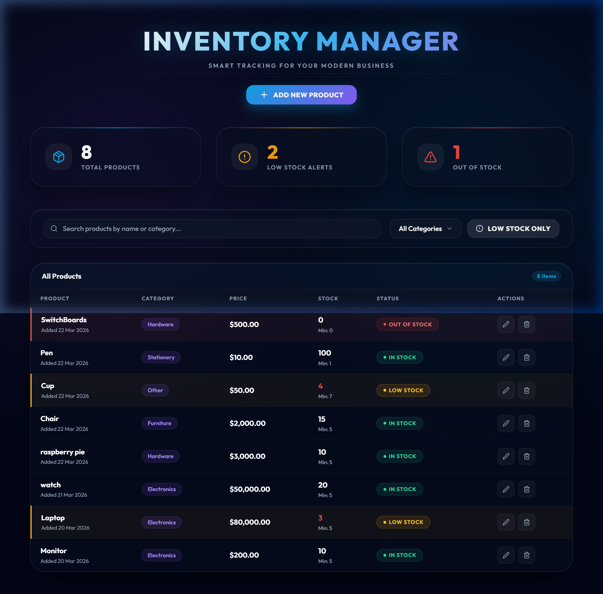
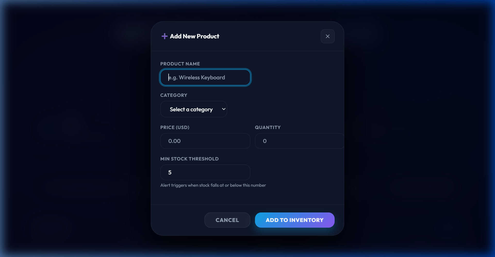

# 📦 Inventory Management System

A premium, full-stack inventory management solution built with **React (Vite 5)**, **Node.js (Express 5)**, and **MongoDB (Mongoose 8.x)**. This project has been polished to meet professional standards in UI/UX, security, and React efficiency.

---

## ✨ Features

- **Full CRUD Operations**: Create, Read, Update, and Delete products with real-time feedback.
- **Advanced Search & Filtering**: Instant search by name/category and specialized status filtering.
- **Intelligent Inventory Alerts**: Distinct visual indicators for **Low Stock** (Orange) and **Out of Stock** (Red).
- **Premium Metrics Dashboard**: High-level overview of total products, low stock alerts, and out-of-stock items.
- **Modern Responsive UI**: Fully responsive glassmorphism design with backdrop-blurs and smooth animations.
- **Professional Notifications**: Non-blocking **Toast system** for a seamless user experience.

---

## 📸 Screenshots

### 🖥️ Dashboard Overview


### ✍️ Add/Edit Product


---

## 🔌 API Endpoints

| Method | Endpoint | Description |
| :--- | :--- | :--- |
| **POST** | `/products` | Add a new product to inventory |
| **GET** | `/products` | Retrieve all products (sorted by most recent) |
| **PUT** | `/products/:id` | Update an existing product's details |
| **DELETE** | `/products/:id` | Permanently remove a product |
| **GET** | `/products/low-stock` | Retrieve products at or below their min stock threshold |

---

## 🎯 Evaluation Criteria Alignment

### 1. 🧠 Problem Understanding & Approach
- **Logical Distinction**: Recognized that "Low Stock" and "Out of Stock" are distinct states. Implemented logic to handle them independently.
- **Structured Workflow**: Followed an iterative approach from Planning to Verification.

### 2. 🔌 API Design & Data Modeling
- **RESTful Principles**: Clean endpoints for CRUD and specialized filtering.
- **Rich Modeling**: Utilized **Mongoose Virtuals** for a single source of truth on stock status.
- **Sanitization**: Strict request body filtering in `PUT` to protect read-only fields.

### 3. 🧹 Code Structure & Cleanliness
- **Modular Architecture**: Clear separation between `models`, `routes`, and atomic `components`.
- **Environment Hygiene**: Robust `.gitignore` for security and repository cleanliness.

### 4. ⚛️ Frontend Logic & State Management
- **Optimization**: Used `useCallback` and `useMemo` for high performance.
- **Modern Hooks**: Consolidated `useEffect` to eliminate redundant network requests.

### 5. 🛡️ Error Handling & Edge Cases
- **Non-blocking UI**: Custom **Toast system** for seamless user feedback.
- **Zero-Quantity Handling**: Specific red visual indicators for the "Out of Stock" edge case.

---

## 🧩 Assumptions & Technical Decisions

- **Single Threshold**: Assumed a global `minStock` property per product is sufficient for "Low Stock" identification.
- **Optimistic Updates**: Assumed a non-blocking UI style was preferred, hence the replacement of `alerts()` with Toasts.
- **Proxy Usage**: Assumed a Vite Proxy is preferred over hardcoded URLs to handle CORS issues cleanly in development.
- **State Management**: Assumed Local State + Axios for data fetching was sufficient given the project's scale (vs Redux/Context).

---

## 🛠️ Tech Stack

- **Frontend**: React 18, Vite 5, Axios, Lucide-React
- **Backend**: Node.js, Express 5, Mongoose 8.x
- **Database**: MongoDB (Local/Atlas)

---

## 📂 Directory Structure

```text
Inventory Management System/
├── client/             # Frontend React (Vite)
│   ├── src/
│   │   ├── components/ # Atomic components (Toast, Form, Stats)
│   │   ├── App.jsx     # State orchestration & logic
│   │   └── index.css   # Premium Design System
├── server/             # Backend Express API
├── .gitignore          # Repo hygiene
└── README.md           # Documentation
```

---

## ⚙️ Setup Instructions

### Step 1: Backend Setup
1. `cd server`
2. `npm install`
3. Configure `.env` (Port 5000, MONGODB_URI)
4. `npm start`

### Step 2: Frontend Setup
1. `cd client`
2. `npm install`
3. `npm run dev` (Access at `http://localhost:5173`)

---

## 🚀 Deployment Guide (Cloud)

### 1. Database (MongoDB Atlas)
- Replace `localhost` in your `.env` with the cluster connection string.

### 2. Backend (Render / Railway)
- Connect repo, set build command to `npm install` and start command to `node server/server.js`.

### 3. Frontend (Vercel / Netlify)
- Automatic detection of Vite config for production-ready frontend hosting.

---

## 👤 Author

**Rathindra Halder**
